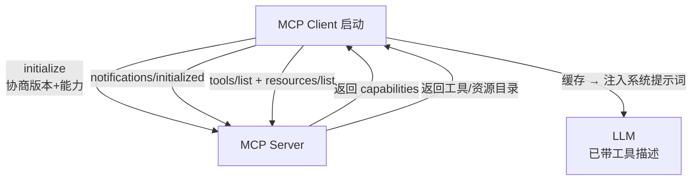
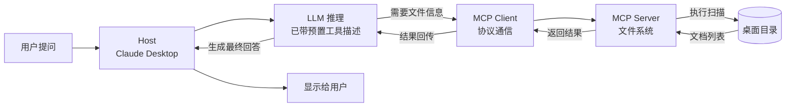
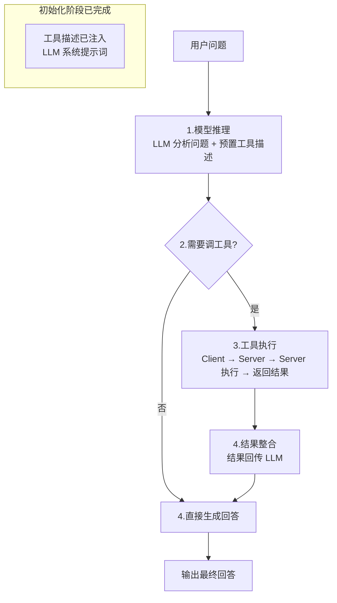
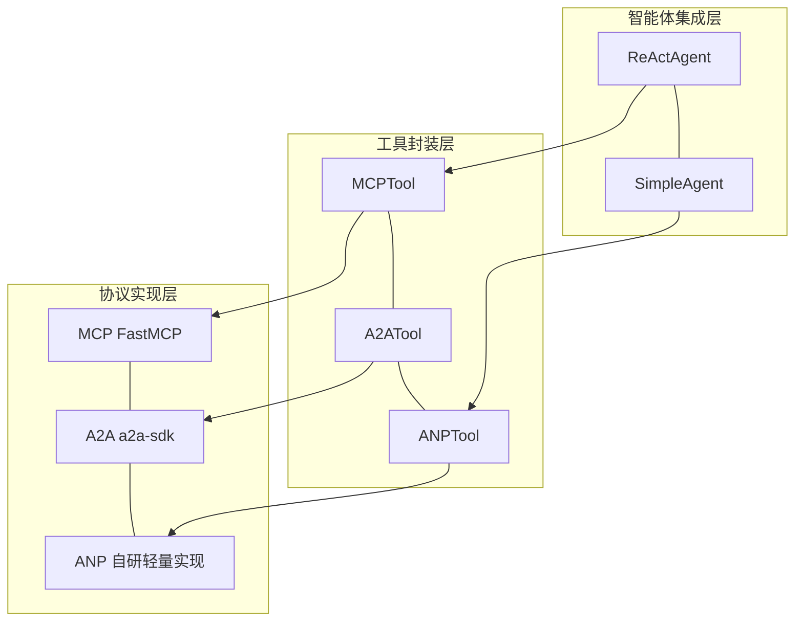
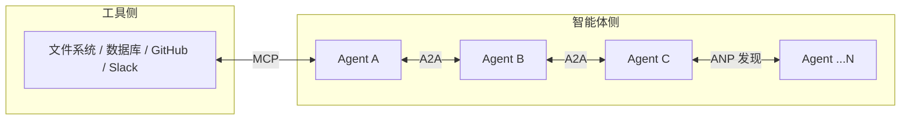

# 智能体通信协议（MCP / A2A / ANP）

参考资料：

- [第10章通信协议（MCP / A2A / ANP）](https://datawhalechina.github.io/hello-agents/#/./chapter10/%E7%AC%AC%E5%8D%81%E7%AB%A0%20%E6%99%BA%E8%83%BD%E4%BD%93%E9%80%9A%E4%BF%A1%E5%8D%8F%E8%AE%AE)

---

## 0. 一句话总览

三种协议对应三类通信场景，**不相互替代，而是分层互补**：

| 协议 | 全称 | 提出方 | 解决的问题 | 设计哲学 |
| --- | --- | --- | --- | --- |
| **MCP** | Model Context Protocol | Anthropic | 智能体 ↔ 工具/资源 | 上下文共享 |
| **A2A** | Agent-to-Agent Protocol | Google | 智能体 ↔ 智能体 | 对等通信 |
| **ANP** | Agent Network Protocol | 开源社区 | 大规模网络中的发现与连接 | 去中心化服务发现 |

> 类比：MCP 是"USB-C 统一接口"，A2A 是"同事间的对话"，ANP 是"互联网的 DNS + 路由"。

---

## 1. 为何需要通信协议

[第七章的 ReAct 智能体](https://datawhalechina.github.io/hello-agents/#/./chapter7/%E7%AC%AC%E4%B8%83%E7%AB%A0%20%E6%9E%84%E5%BB%BA%E4%BD%A0%E7%9A%84Agent%E6%A1%86%E6%9E%B6?id=_742-reactagent)虽已具备推理 + 工具调用 + 记忆，但面临三个根本性限制：

1. **工具集成的困境** —— 每接入一个新服务（GitHub、数据库、文件系统）都要手写一个 Tool 类，不同开发者的工具无法互通。
2. **能力扩展的瓶颈** —— 能力被锁死在预先定义的工具集内，无法运行时动态发现新服务。
3. **协作的缺失** —— 当任务需要多专业智能体协作（研究员 + 撰写员 + 编辑），只能靠手动编排。

传统手写适配器的痛点：代码重复（HTTP/认证/错误处理每个工具重写一遍）、难维护（API 变更要改所有相关工具）、无法复用、扩展性差。

**通信协议的核心价值**（类比 TCP/IP）：标准化接口、互操作性、动态发现、可扩展性。引入 MCP 后，连接一个 MCP 服务器即可自动获得其全部工具能力，无需手写适配器。

---

## 2. 三种协议设计理念对比

### 2.1 MCP：智能体与工具的桥梁

- 由 Anthropic 提出，**标准化智能体与外部工具/资源的通信方式**。
- 不仅是 RPC，更强调**上下文共享**：访问代码仓库时，不仅返回文件内容，还返回代码结构、依赖关系、提交历史等丰富上下文，让智能体做出更智能的决策。

### 2.2 A2A：智能体间的对话

- 由 Google 提出，**实现智能体之间的点对点通信**。
- 设计哲学是"对等通信"：每个智能体既是服务提供者又是消费者，可主动发起请求也可响应他人，**避免中心化协调器的瓶颈**，网络更灵活可扩展。

### 2.3 ANP：智能体网络的基础设施

- 概念性协议框架，由开源社区维护，**生态尚未成熟**。
- 解决的是"成百上千智能体网络中如何找到所需服务"的问题，提供服务注册、发现和路由机制，**无需预先配置所有连接关系**。

### 2.4 如何选型

协议仍处于发展早期，**MCP 生态相对成熟**，但工具时效性取决于维护者，优先选大公司背书的 MCP 工具。选型决策树：

- 智能体要访问外部服务（文件 / 数据库 / API）→ **MCP**
- 多个智能体相互协作完成任务 → **A2A**
- 构建大规模智能体生态系统 → **ANP**

---

## 3. MCP 协议详解

### 3.1 MCP 是智能体的"USB-C"

传统方式下，同一个工具要为 OpenAI、Claude 等不同 LLM 平台分别编写 function call 适配代码（格式差异如 `parameters` vs `input_schema`），切换模型就要重写。MCP 统一了智能体与外部工具的交互方式——**只要模型支持 MCP，就能无缝访问相同的工具和资源**。

### 3.2 三层架构：Host / Client / Server

MCP 连接有两个独立阶段，**初始化只做一次，操作阶段每次对话都走**：

#### 阶段一：会话初始化（只做一次）

Client 启动时先完成协议握手 + 能力发现，工具描述注入 LLM 系统提示词后就不再重复：



#### 阶段二：操作阶段（每次用户对话）

工具描述已预置在 LLM 的系统提示词中，LLM 推理后才决定是否调 Client：



> 关键区分：图1 的 `tools/list` 是**初始化动作**（只做一次），图2 是**用户单次交互**（每次都走）。二者不是线性前后关系，而是**先初始化 → 再反复操作**的循环关系。

三层职责分离：

| 层 | 职责 | 关注点 |
| --- | --- | --- |
| **Host（宿主）** | 接收用户提问、与 LLM 交互、管理对话流程 | 用户体验 |
| **Client（客户端）** | 与 MCP Server 建立连接、收发请求、缓存工具目录 | 协议通信 |
| **Server（服务器）** | 执行具体功能（文件扫描、API 调用等） | 功能实现 |

> 开发者只需关注 Server 端实现，无需关心 Host/Client 细节。

### 3.3 三大核心能力

| 能力 | 性质 | 典型用途 |
| --- | --- | --- |
| **Tools（工具）** | 主动的（执行操作） | 调 API、写文件、发消息 |
| **Resources（资源）** | 被动的（提供数据） | 读文件、查询数据库 |
| **Prompts（提示）** | 指导性的（提供模板） | 预设的 prompt 模板 |

### 3.4 操作阶段内部流程

初始化完成后，每次用户对话的 LLM 决策流程是**完全自动化**的。注意：**步骤 1-2 已在初始化阶段完成**，此处从"LLM 收到用户问题"开始：



> 关键点：LLM 是否调用工具、调用哪个工具，**取决于工具描述的质量**。编写清晰、准确的工具描述至关重要。如果 Server 侧工具列表有变更，会通过 `notifications/tools/list_changed` 通知 Client 重新拉取目录（仍属于初始化阶段的增量更新）。

### 3.5 MCP vs Function Calling

| 维度 | Function Calling | MCP |
| --- | --- | --- |
| 标准化 | 各 LLM 厂商格式不同（`parameters` vs `input_schema`） | 跨模型统一协议 |
| 工具实现 | 每个工具自己写 HTTP/认证/错误处理 | Server 统一封装，Client 透明调用 |
| 动态发现 | 工具集编码时固定 | 运行时 `list_tools` 动态获取 |
| 复用性 | 不同项目/模型间难复用 | 一次实现，到处可用 |
| 切换成本 | 换模型要重写工具定义 | 换模型不影响工具 |

---

## 4. A2A 协议要点

- 基于 Google 官方 `a2a-sdk` 实现。
- **对等通信**模型：每个智能体既是服务提供者也是消费者，无中心化协调器瓶颈。
- 适用于"多专业智能体像人类团队一样对话、协商、协作"的场景。
- 与 MCP 的关键区别：MCP 是"智能体调工具"（工具是被动的），A2A 是"智能体调智能体"（双方对等）。

> 详细实战内容参见原书 10.3 节（本文未展开）。

---

## 5. ANP 协议要点

- 概念性协议框架，生态尚不成熟，书中为**自研轻量级概念实现**（官方实现见 [agent-network-protocol/AgentConnect](https://github.com/agent-network-protocol/AgentConnect)）。
- 解决"大规模网络中如何动态发现和连接智能体"的问题。
- 提供服务注册、发现、路由机制，无需预先配置所有连接关系。
- 适用场景：构建包含成百上千智能体的大规模生态系统。

> 详细实战内容参见原书 10.4 节（本文未展开）。

---

## 6. HelloAgents 三层架构设计



| 层 | 内容 | 设计意图 |
| --- | --- | --- |
| **协议实现层** | MCP（FastMCP）、A2A（a2a-sdk）、ANP（自研概念实现） | 三种协议的具体实现 |
| **工具封装层** | MCPTool / A2ATool / ANPTool 均继承 BaseTool，提供一致的 `run()` 方法 | 让智能体以相同方式使用不同协议 |
| **智能体集成层** | ReActAgent、SimpleAgent 等通过 Tool System 使用协议工具 | 智能体无需关心底层协议细节 |

设计目标：**让学习者以最简单的方式使用协议，同时保持应对复杂场景的灵活性**。

---

## 7. 快速体验

```python
from hello_agents.tools import MCPTool, A2ATool, ANPTool

# 1. MCP：访问工具（调用 add 计算 10+20）
mcp_tool = MCPTool()
result = mcp_tool.run({
    "action": "call_tool",
    "tool_name": "add",
    "arguments": {"a": 10, "b": 20}
})
print(f"MCP计算结果: {result}")  # 输出: 30.0

# 2. ANP：服务发现（注册 calculator 服务并查询）
anp_tool = ANPTool()
anp_tool.run({
    "action": "register_service",
    "service_id": "calculator",
    "service_type": "math",
    "endpoint": "http://localhost:8080"
})
services = anp_tool.run({"action": "discover_services"})
print(f"发现的服务: {services}")

# 3. A2A：智能体通信（创建客户端连接到指定服务）
a2a_tool = A2ATool("http://localhost:5000")
print("A2A工具创建成功")
```

安装（第10章版本）：

```bash
pip install "hello-agents[protocol]==0.2.2"
```

---

## 8. 本章小结与选型决策

### 8.1 三协议关系图



### 8.2 选型一句话

- **接外部服务** → MCP（生态最成熟，优先选）
- **多智能体协作** → A2A（点对点，无中心瓶颈）
- **大规模网络发现** → ANP（概念阶段，慎用生产）

### 8.3 核心认知

1. 通信协议是智能体的**基础设施层**，类比 TCP/IP 之于互联网。
2. 三种协议**分层互补**，不是非此即彼：一个系统可能同时用 MCP 接工具、用 A2A 做协作、用 ANP 做发现。
3. 协议仍处发展早期，**MCP 生态相对成熟**，A2A/ANP 需持续观察；选大公司背书的工具更稳妥。
4. 协议的本质价值：**标准化接口 + 互操作性 + 动态发现 + 可扩展性**，让智能体摆脱"为每个服务手写适配器"的重复劳动。
