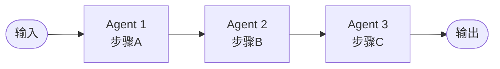
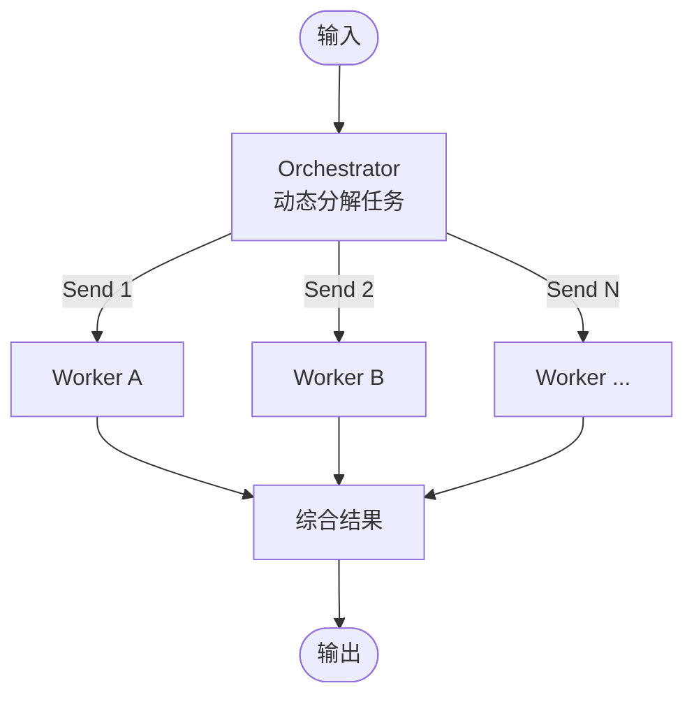
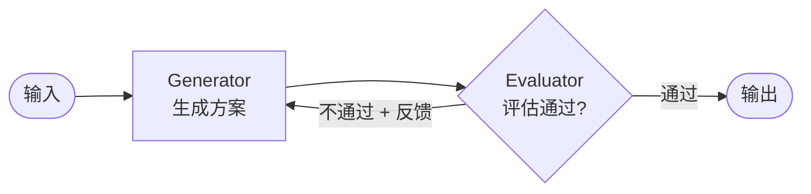
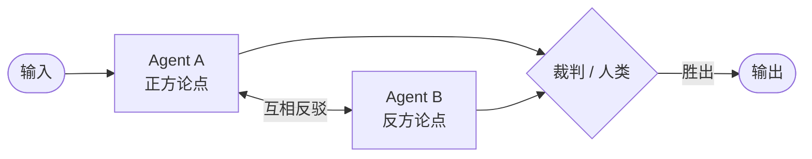
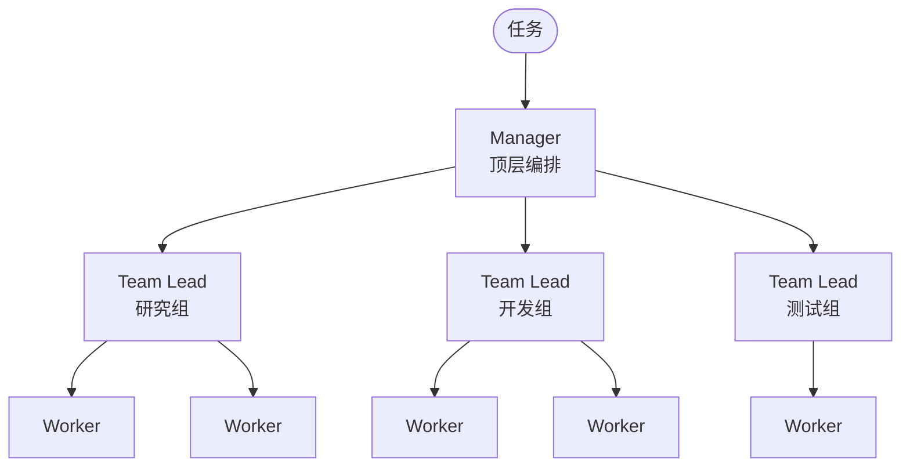
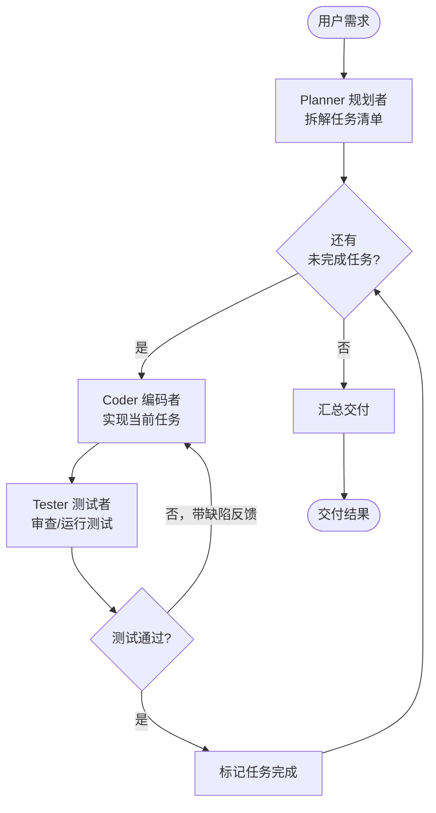

# Multi-Agent 系统架构设计（规划者 + 编码者 + 测试者）

参考资料：

- [《Hello-Agents》第6章「框架开发实践」6.2 AutoGen 软件开发团队](https://datawhalechina.github.io/hello-agents/#/./chapter6/%E7%AC%AC%E5%85%AD%E7%AB%A0%20%E6%A1%86%E6%9E%B6%E5%BC%80%E5%8F%91%E5%AE%9E%E8%B7%B5?id=_62-%e6%a1%86%e6%9e%b6%e4%b8%80%ef%bc%9aautogen)，产品经理 / 工程师 / 代码审查员四个角色的任务分解与协作——正是"规划者 + 编码者 + 测试者"的原型。
- [《Hello-Agents》第6章「框架开发实践」6.5 LangGraph 共享状态（State）](https://datawhalechina.github.io/hello-agents/#/./chapter6/%E7%AC%AC%E5%85%AD%E7%AB%A0%20%E6%A1%86%E6%9E%B6%E5%BC%80%E5%8F%91%E5%AE%9E%E8%B7%B5?id=_65-%e6%a1%86%e6%9e%b6%e5%9b%9b%ef%bc%9alanggraph)，节点间上下文传递的机制。
- [Anthropic《构建高效Agent》中文翻译·多智能体系统章节](https://blog.csdn.net/weixin_43807749/article/details/152788870)，Orchestrator-Worker、Pipeline、Debate、Evaluator-Optimizer、Hierarchical 五种编排模式的出处。

---

## 0. 先问一个问题：真的需要 Multi-Agent 吗？

Anthropic 的核心建议：**优先用单 Agent + 工具，只在多 Agent 能明显带来收益时才拆分。**

多 Agent 的代价：

| 代价 | 说明 |
| --- | --- |
| Token 成本高 | 每个 Agent 独立跑一轮 LLM，Agent 间还要传递上下文，token 消耗成倍增长 |
| 延迟增加 | 多轮串行/并行调用，端到端响应变慢 |
| 调试困难 | 错误可能出在任一 Agent 的任一环节，状态分散 |
| 上下文丢失 | Agent 间传递的是"摘要"而非完整上下文，信息有损 |

**适合拆成 Multi-Agent 的信号**：

1. 任务步骤可以**明确定义**、且步骤间需要**不同的 prompt/工具/上下文**（如写代码 vs 测代码，关注点完全不同）；
2. 单 Agent 上下文装不下（如同时处理几十份文档，每批分给不同 worker）；
3. 需要**独立的质量门禁**（一个角色生成、另一个对立角色审查，避免"自己查自己"的盲区）。

> 本项目的"规划者 + 编码者 + 测试者"满足信号 1 和 3：三种角色的 system prompt、工具集、成功标准都不同，且测试者构成独立质量门禁。

---

## 1. 五种主流编排模式

### 1.1 Pipeline（流水线 / Prompt Chaining）

**定义**：把任务拆成**固定的、线性的**串行步骤，前一个 Agent 的输出是后一个 Agent 的输入。步骤在编码时就已确定。



**特点**：
- 拓扑固定，无动态分派；
- 每个步骤职责单一、可独立测试；
- 可在步骤间加"闸门"（gate）：中间结果不合格就提前终止或回退。

**适用场景**：流程可预先确定的任务。如：翻译流水线（翻译 → 校对 → 润色）、文档生成（大纲 → 正文 → 排版）、**规划 → 编码 → 测试**。

**LangGraph 实现要点**：普通边串接节点，条件边做闸门。

```js
// 线性流水线：A → B → C，B 处设质量闸门
const workflow = new StateGraph(StateAnnotation)
  .addNode('planner', plannerNode)
  .addNode('coder', coderNode)
  .addNode('tester', testerNode)
  .addEdge(START, 'planner')
  .addEdge('planner', 'coder')
  .addConditionalEdges('coder', (state) => state.code_ready ? 'tester' : 'coder', {
    tester: 'tester', coder: 'coder',   // 闸门：代码未完成则重做
  })
  .addEdge('tester', END);
```

**优缺点**：✅ 结构简单、可预测、易调试；❌ 不适应子任务数量/类型不可预知的场景。

---

### 1.2 Orchestrator-Worker（编排者-工作者）

**定义**：一个**中央编排 Agent（Orchestrator）** 动态地把任务分解成子任务，分派给多个 **Worker Agent** 并行处理，最后由编排者（或专门的综合节点）汇总结果。



**与 Pipeline 的关键区别**：

| 维度 | Pipeline | Orchestrator-Worker |
| --- | --- | --- |
| 任务分解时机 | 编码期固定 | **运行时动态**（LLM 决定拆几个、派给谁） |
| Worker 数量 | 固定 | 由输入决定（如 3 份文档 → 3 个 worker，100 份 → 100 个） |
| 典型实现 | 普通边 | **条件边 + `Send` 动态扇出**（Day8 学过） |

**适用场景**：子任务数量不可预知、且可并行。如：给一份代码库的多个文件分别做审查、对多个搜索关键词并行检索、批量处理用户上传的 N 份文档。

**LangGraph 实现要点**：路由函数返回 `Send` 对象数组，每个 Send 携带独立 State 副本。

```js
// Orchestrator 节点：动态决定要派多少个 worker
function orchestratorNode(state) {
  // LLM 分析后返回子任务列表（数量运行时确定）
  return { subtasks: [{ id: 1, topic: '...' }, { id: 2, topic: '...' }] };
}

// 路由：为每个子任务生成一个 Send，动态扇出到 worker
function fanout(state) {
  return state.subtasks.map((t) => new Send('worker', { task: t }));
}

graph.addConditionalEdges('orchestrator', fanout, ['worker']);
graph.addEdge('worker', 'synthesizer');  // worker 结果经 reducer 汇总后综合
```

**优缺点**：✅ 灵活、可并行、扩展性强；❌ 编排者 prompt 设计复杂，汇总逻辑需处理结果顺序/质量参差。

---

### 1.3 Evaluator-Optimizer（评估者-优化者）

**定义**：一个 Agent 负责**生成**（Generator），另一个负责**评估/挑错**（Evaluator），评估不通过则带着反馈回到生成者修改，**循环迭代直到质量达标**。两个 Agent 是**协作关系**——评审者只给反馈、不产出，目标是帮生成者改进。



**关键特征**：环是**单向**的（反馈回流到生成者）；评估者不参与生成。

**适用场景**：质量要求高、有明确评价标准、且"自己生成自己检查"存在盲区的任务。如：代码编写 + 代码审查、文案写作 + 编辑审稿、法律文书 + 合规审查。本项目的"编码者 + 测试者"正是此模式。

**LangGraph 实现要点**：生成节点 → 条件边（评估结果）→ 不通过回到生成节点（形成环），通过则 END。State 中需累积"反馈历史"和"迭代轮次"。

```js
// 评估路由：通过则结束，不通过带反馈回到生成者
function evaluateRoute(state) {
  if (state.iteration >= MAX_ITERATIONS) return END;        // 防死循环
  return state.test_passed ? END : 'generator';            // 环：失败回炉
}

graph.addNode('generator', generatorNode)
     .addNode('evaluator', evaluatorNode)
     .addEdge(START, 'generator')
     .addEdge('generator', 'evaluator')
     .addConditionalEdges('evaluator', evaluateRoute, {
       generator: 'generator',   // 回到生成者（带反馈）
       [END]: END,
     });
```

**优缺点**：✅ 质量显著提升，形成质量闭环；❌ 多轮迭代 token/延迟成本高，需设最大轮次防死循环，评估标准要可判定。

---

### 1.4 Debate（辩论）

**定义**：两个（或多个）Agent 持**对立观点**互相反驳，由**第三方裁判**（Agent 或人类）裁决哪方胜出。与 Evaluator-Optimizer 不同，这里**双方都会生成**、是**对抗关系**而非协作。



**与 Evaluator-Optimizer 的关键区别**：

| 维度 | Evaluator-Optimizer | Debate |
| --- | --- | --- |
| Agent 关系 | 协作（评审者帮生成者改进） | 对抗（双方互相反驳） |
| 参与方 | 1 个生成者 + 1 个评估者，**只有生成者产出** | 2 个都能产出，**双方各持观点** |
| 环形态 | 单向（反馈回流到生成者） | 双向对抗，需第三方裁决才能收敛 |
| 终止条件 | 评估者判定"通过" | 裁判裁决"哪方胜出"或达到轮次上限 |
| 典型用例 | 代码+审查、写作+审稿 | 红蓝对抗、方案辩论、风险分析 |

**适用场景**：需要多视角碰撞、避免单一视角盲区的决策场景。如：技术方案选型（保守 vs 激进）、安全风险分析（攻击方 vs 防御方）、产品决策辩论。

**LangGraph 实现要点**：两个生成节点交替执行 + 裁判节点做终止裁决。State 中需累积双方论点历史。

```js
// Debate 路由：未达轮次上限则交替反驳，达到后转裁判裁决
function debateRoute(state) {
  if (state.round >= MAX_ROUNDS) return 'judge';   // 达上限转裁判
  return state.last_speaker === 'A' ? 'agentB' : 'agentA';  // 交替反驳
}

graph.addNode('agentA', agentANode)     // 正方：读反方上轮论点 → 反驳
     .addNode('agentB', agentBNode)     // 反方：读正方上轮论点 → 反驳
     .addNode('judge', judgeNode)       // 裁判：综合双方历史 → 裁决胜出方
     .addEdge(START, 'agentA')
     .addConditionalEdges('agentA', debateRoute, {
       agentB: 'agentB', judge: 'judge',
     })
     .addConditionalEdges('agentB', debateRoute, {
       agentA: 'agentA', judge: 'judge',
     })
     .addEdge('judge', END);
```

**优缺点**：✅ 多视角碰撞、暴露单一视角盲区；❌ 至少 3 个 Agent（两方+裁判），token 成本最高；对抗双方容易"为反驳而反驳"偏题，裁判标准难定义。

---

### 1.5 Hierarchical（分层 / 层级）

**定义**：**多层 Orchestrator** 形成树状管理结构。顶层 Manager 把大任务分派给几个中层 Team Lead，每个 Lead 再管理自己的一组 Worker。类似公司的"CEO → 部门经理 → 员工"。



**本质**：Orchestrator-Worker 的**递归嵌套**——每个子团队内部又是一个小的编排系统。AutoGen 的 `GroupChatManager` 多团队协作即此模式。

**适用场景**：大规模、多职能协作的复杂工程。如：一个软件开发项目中，"研究团队"（查资料）、"开发团队"（写代码）、"测试团队"（验证）各自有内部编排，顶层由一个 Manager 协调。

**LangGraph 实现要点**：用**子图（Subgraph）**封装每个团队，父图把 subgraph 当作一个节点调用。

```js
// 研究组内部是一张独立的子图（有自己的 orchestrator + workers）
const researchTeam = new StateGraph(ResearchState)
  .addNode('lead', researchLead)
  .addNode('searcher', searcherWorker)
  .addConditionalEdges('lead', researchFanout, ['searcher'])
  .addEdge('searcher', 'lead')
  .compile();

// 父图把子图当作普通节点
const parentGraph = new StateGraph(ParentState)
  .addNode('manager', managerNode)
  .addNode('research_team', researchTeam)   // 子图作为节点
  .addNode('dev_team', devTeam)
  .addNode('qa_team', qaTeam)
  .addConditionalEdges('manager', dispatchRoute, {
    research: 'research_team', dev: 'dev_team', qa: 'qa_team',
  });
```

**优缺点**：✅ 可承载大规模复杂任务，各团队内部高内聚、上下文隔离；❌ 结构最复杂，跨层上下文传递易丢失，非必要不使用。

---

### 1.6 模式选型速查

| 模式 | 拓扑 | 子任务何时确定 | 并发 | 典型场景 |
| --- | --- | --- | --- | --- |
| Pipeline | 线性固定 | 编码期 | 通常串行 | 翻译、文档、规划→编码→测试 |
| Orchestrator-Worker | 星型动态 | **运行时** | 并行 fan-out | 批量文档处理、多关键词检索 |
| Evaluator-Optimizer | 单向环（反馈回流） | 编码期 | 串行（往返） | 代码+审查、写作+审稿 |
| Debate | 双向对抗环 + 裁判 | 编码期 | 串行（对抗） | 红蓝对抗、方案辩论 |
| Hierarchical | 树状多层 | 运行时 | 分层并行 | 大型多职能工程团队 |

> 实际系统常是**组合**：下面的"规划者+编码者+测试者"就是 **Pipeline 主干 + Evaluator-Optimizer 反馈环**。

---

## 2. 系统设计：规划者 + 编码者 + 测试者

### 2.1 角色定义

| 角色 | 对应 AutoGen | 职责 | system prompt 关注点 | 工具 |
| --- | --- | --- | --- | --- |
| **Planner 规划者** | 产品经理 | 理解需求，拆解为有序任务清单，明确验收标准 | 任务分解、边界界定、不写代码 | 无（纯推理） |
| **Coder 编码者** | 工程师 | 按当前任务实现代码，输出完整可运行代码 | 代码规范、可运行、带注释 | 文件读写、执行命令 |
| **Tester 测试者** | 代码审查员 | 审查/运行代码，判定通过或给出具体缺陷反馈 | 挑错、可判定的验收标准、不手软 | 执行测试、静态检查 |

### 2.2 协作流程（Pipeline 主干 + 测试反馈环）



流程说明：

1. **Planner** 一次性产出任务清单（写入 `state.tasks`）；
2. 主循环：取第一个未完成任务 → **Coder** 实现 → **Tester** 验证；
3. 测试**不通过**：Tester 把具体缺陷写入 `state.feedback`，条件边路由回 **Coder**（Evaluator-Optimizer 环）；
4. 测试**通过**：标记任务完成，回到任务选择；
5. 全部任务完成 → 汇总交付。

### 2.3 State 设计（LangGraph）

```js
const DevTeamState = Annotation.Root({
  ...MessagesAnnotation.spec,
  requirement: Annotation(),          // 用户原始需求
  tasks: Annotation({                 // 任务清单（Planner 产出）
    reducer: (old, update) => update, // 整体覆盖
    default: () => [],
  }),
  current_task: Annotation(),         // 当前正在做的任务 { id, desc, status }
  code: Annotation(),                 // Coder 产出的代码
  feedback: Annotation({              // Tester 的缺陷反馈（驱动 Coder 返工）
    reducer: (old, update) => update,
    default: () => null,
  }),
  iteration: Annotation({             // 当前任务的返工轮次（防死循环）
    reducer: (old, update) => update,
    default: () => 0,
  }),
});
```

### 2.4 图结构（节点 + 边 + 路由）

```js
const MAX_RETRY = 3;  // 单个任务最多返工 3 次

const workflow = new StateGraph(DevTeamState)
  // 节点
  .addNode('planner', plannerNode)    // 规划：需求 → 任务清单
  .addNode('coder', coderNode)        // 编码：任务(+反馈) → 代码
  .addNode('tester', testerNode)      // 测试：代码 → { passed, feedback }
  .addNode('reporter', reporterNode)  // 汇总交付

  // 边
  .addEdge(START, 'planner')
  .addEdge('planner', 'coder')                          // 规划完开始第一个任务
  .addEdge('coder', 'tester')                           // 编码完 → 测试

  // 测试路由：通过 → 下一个任务/交付；不通过 → 回炉（Evaluator-Optimizer 环）
  .addConditionalEdges('tester', (state) => {
    if (state.feedback && state.iteration < MAX_RETRY) return 'rework';  // 返工
    return state.tasks.some((t) => t.status === 'todo') ? 'next' : 'done';
  }, {
    rework: 'coder',     // 带反馈回到编码者
    next: 'coder',       // 标记完成后取下一个任务（可由 coder 前置一个 pick 节点）
    done: 'reporter',
  })
  .addEdge('reporter', END);
```

### 2.5 关键设计要点

1. **反馈必须具体、可执行**：Tester 不能只说"代码有问题"，要返回"第 X 行：Y 函数在 Z 输入下返回错误值，期望 A 实际 B"。空泛反馈会让 Coder 瞎改。
2. **必须设最大返工轮次**（`MAX_RETRY`）：防止 Coder/Tester 互相踢皮球死循环；超限后上报人工（可接 Day9 的 `interrupt` 人机协作）。
3. **上下文隔离**：Coder 不需要看到 Planner 的完整推理过程，只给它"当前任务描述 + 上一轮反馈"；Tester 只看"代码 + 验收标准"。每个角色 prompt 精简，降低 token 成本。
4. **状态归位**：任务状态（todo/done）、当前迭代轮次都放 State 而非闭包变量，才能配合 checkpointer 做中断恢复（Day9）。

### 2.6 与三种基础模式的对应

本系统是**模式组合**的典型案例：

| 结构部分 | 对应模式 |
| --- | --- |
| Planner → Coder → Tester → 交付 的主干 | **Pipeline**（固定线性流程） |
| Tester 不通过 → 回到 Coder 的环 | **Evaluator-Optimizer**（质量闭环） |
| Planner 若动态决定任务数、并行分派多个 Coder | 扩展为 **Orchestrator-Worker**（`Send` 扇出） |
| 多个团队（前端组/后端组/测试组）各自有内部编排 | 扩展为 **Hierarchical**（子图嵌套） |
| Tester 拿不准时升级为红蓝两个 Agent 对抗辩论 | 扩展为 **Debate** |
