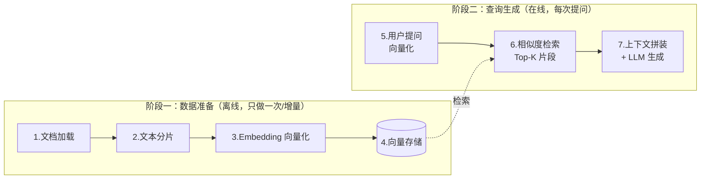
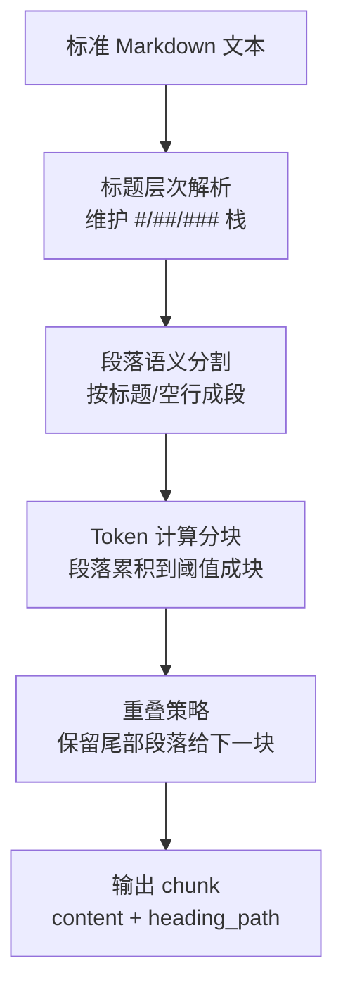
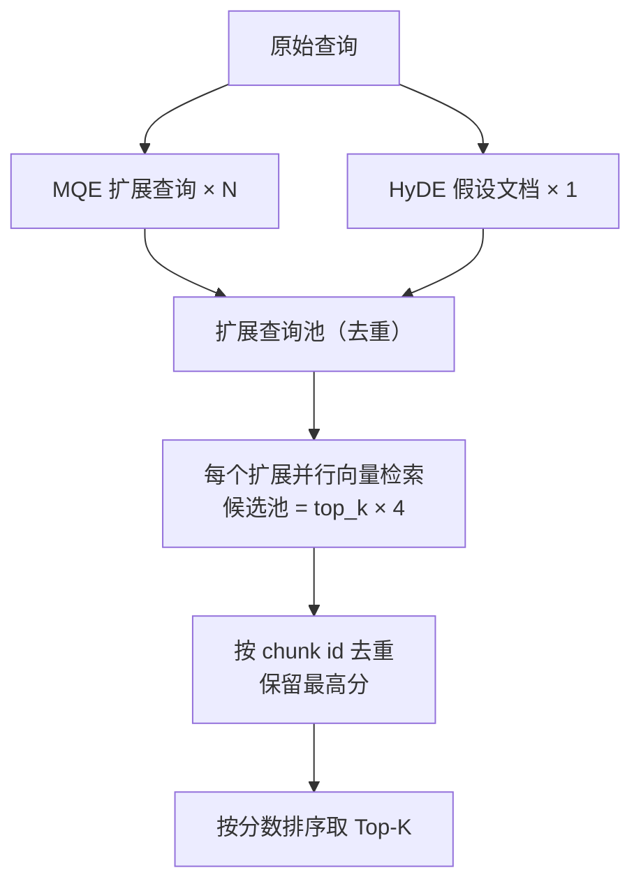

# 《RAG系统：知识检索增强》读书笔记

理解[《Hello-Agents》第8章「记忆与RAG系统」RAG 全流程部分](https://datawhalechina.github.io/hello-agents/#/./chapter8/%E7%AC%AC%E5%85%AB%E7%AB%A0%20%E8%AE%B0%E5%BF%86%E4%B8%8E%E6%A3%80%E7%B4%A2?id=_831-rag%e7%9a%84%e5%9f%ba%e7%a1%80%e7%9f%a5%e8%af%86)

要求：

- 吃透全流程：文档加载 → 文本分片 → Embedding 向量化 → 向量存储 → 检索 → 上下文拼装 → LLM 生成
- RAGTool的处理流程：任意格式文档 → MarkItDown转换 → Markdown文本 → 智能分块 → 向量化 → 存储检索

***

## 0. 一句话总览

**RAG（Retrieval-Augmented Generation，检索增强生成）= 先检索、后生成**：LLM 回答前先从外部知识库捞出相关片段，拼进 Prompt 当上下文，让模型"开卷考试"而不是"凭记忆裸答"。

三个词拆开理解：

| 词                 | 含义                         |
| ----------------- | -------------------------- |
| **检索 Retrieval**  | 从知识库中查询相关内容（向量相似度匹配）       |
| **增强 Augmented**  | 把检索结果注入 Prompt，作为模型生成的事实依据 |
| **生成 Generation** | LLM 基于上下文 + 问题生成准确、可溯源的答案  |

***

## 1. 为什么需要 RAG：LLM 原生能力的三个硬伤

| 痛点          | 具体表现                | RAG 如何解决            |
| ----------- | ------------------- | ------------------- |
| **知识截止**    | 训练数据有截止日期，不知道新发生的事  | 知识库可随时增删，检索的是最新文档   |
| **幻觉**      | 一本正经编造不存在的事实（无来源校验） | 答案受检索到的真实文档约束，可溯源   |
| **私有数据不可见** | 企业内部文档、个人笔记从未进过训练集  | 任意文档灌进向量库即可被检索，无需微调 |

> 对比微调和 RAG 这两条技术路线：
> **微调（Fine-tuning）** 是把知识"背进"模型参数里（成本高、更新慢、不可溯源）；
> **RAG** 是让模型"查资料"（成本低、实时更新、答案可引用原文）。
> 知识类需求优先 RAG，能力/风格类需求才考虑微调。

***

## 2. RAG 全流程：两大阶段、七个步骤



### 2.1 阶段一：数据准备（索引构建）

| 步骤                    | 做什么                                    | 关键决策                        |
| --------------------- | -------------------------------------- | --------------------------- |
| **1. 文档加载**           | PDF/Word/网页/图片等解析成纯文本                  | 多格式统一转换（见第 4 节 MarkItDown）  |
| **2. 文本分片（Chunking）** | 长文档切成几百 token 的小块                      | 块太大→检索不精准且费 token；块太小→语义不完整 |
| **3. Embedding**      | 每个 chunk 经嵌入模型转成高维向量（如 384/768/1024 维） | 语义相近的文本，向量距离也近              |
| **4. 向量存储**           | 向量 + 原文 + 元数据存入向量数据库                   | 支持 ANN 近似最近邻快速检索（Qdrant）    |

> 这一步是"建图书馆索引"：一次性构建、增量更新，查询时直接复用。

### 2.2 阶段二：查询与生成

| 步骤             | 做什么                                                 |
| -------------- | --------------------------------------------------- |
| **5. 提问向量化**   | 用户问题用**同一个嵌入模型**转成向量                                |
| **6. 相似度检索**   | 在向量库中找余弦距离最近的 Top-K 个 chunk                         |
| **7. 拼装 + 生成** | 把检索片段按模板拼进 Prompt（`上下文 + 问题 + "只根据上下文回答"`），LLM 生成答案 |

最终 Prompt 的典型结构：

```text
你是知识问答助手。请只根据下面提供的上下文回答问题，上下文中没有就回答"不知道"。

【上下文】
{retrieved_chunk_1}
{retrieved_chunk_2}
...

【问题】
{user_question}
```

> "只根据上下文回答 + 无依据就说不知道"是抑制幻觉的关键指令。

***

## 3. 关键机制深入理解

### 3.1 Embedding：语义检索的基石

- 嵌入模型把文本映射为高维空间中的向量，**语义越相似，向量距离越近**（通常用余弦相似度衡量）。
- "如何学 Python" 和 "Python 入门教程" 字面几乎不重合，但向量距离很近——这是相对传统关键词检索（BM25/TF-IDF）的核心优势。
- **硬性要求**：建库时和查询时必须用**同一个嵌入模型**，否则向量空间不一致，检索结果全错。

### 3.2 为什么必须分片

1. Embedding 模型有输入长度上限，整篇长文档无法直接向量化；
2. 检索的最小单位是 chunk——用户只问一个点，返回整篇文档既不精准又浪费 LLM token；
3. chunk 带元数据（来源、标题路径、位置），答案才能溯源。

### 3.3 为什么分块要重叠（Overlap）

直接在 token 上限处硬切，会把一个完整论述拦腰截断，导致两个 chunk 都语义残缺。做法是让**相邻块保留一段重叠区**（如块 512 token、重叠 50 token），保证跨边界的句子至少在一个块中完整出现，以少量冗余换语义连续性。

### 3.4 分片策略对比

| 策略         | 原理                         | 优劣                      |
| ---------- | -------------------------- | ----------------------- |
| 固定长度切分     | 按字符/token 数硬切              | 简单，但容易切断语义              |
| 递归字符切分     | 优先按段落 → 句子边界切，LangChain 默认 | 通用性好                    |
| **结构感知切分** | 按 Markdown 标题层级（#/##/###）切 | 语义边界最干净（HelloAgents 采用） |
| 语义切分       | 相邻句向量差异突变处断开               | 最智能，但计算成本高              |

***

## 4. RAGTool 处理流程（HelloAgents 实现）

书中把 RAG 设计为一条 **pipeline（管道）**，核心链路：

```text
任意格式文档 → MarkItDown 转换 → Markdown 文本 → 智能分块 → 向量化 → 存储检索
```

### 4.1 第一步：MarkItDown 统一文档格式

[MarkItDown](https://github.com/microsoft/markitdown) 是微软开源的通用文档转换工具。**设计核心：无论输入什么格式，先统一转成 Markdown，后续所有环节只需处理一种格式**——极大简化了分块器的设计。

| 输入类型  | 格式                          | 转换方式                   |
| ----- | --------------------------- | ---------------------- |
| 文档    | PDF、Word、Excel、PowerPoint   | MarkItDown（PDF 另有增强处理） |
| 图片    | JPG、PNG、GIF                 | OCR 识别                 |
| 音频    | MP3、WAV、M4A                 | 语音转录                   |
| 文本/代码 | TXT、CSV、JSON、HTML、Python、JS | 直接转换                   |

> 转换失败时降级为纯文本读取器（fallback），保证管道不中断。

### 4.2 第二步：Markdown 结构感知的智能分块

正因为统一成了 Markdown，分块器可以利用标题结构做**精确语义分割**，而不是盲目按长度切：



每个 chunk 携带 `heading_path`（如 `"第八章 > RAG系统 > 高级检索策略"`），既保持语义完整，又能在回答时告诉用户出处。

**中英文混合 Token 估算**（控制分块大小必需）：

```python
def _approx_token_len(text: str) -> int:
    # CJK（中日韩）字符按 1 token 计
    cjk = sum(1 for ch in text if _is_cjk(ch))
    # 其他字符按空白分词计数
    non_cjk_tokens = len([t for t in text.split() if t])
    return cjk + non_cjk_tokens
```

> 不能直接用英文"词数 ≈ token"的估算套中文：中文没有空格分词，一个汉字约等于一个 token。

### 4.3 第三步：统一嵌入（三档降级方案）

| 优先级 | 方案                                               | 适用场景                |
| --- | ------------------------------------------------ | ------------------- |
| 1   | DashScope 百炼 API（text-embedding-v3）              | 有 API key，效果好、免本地资源 |
| 2   | 本地 sentence-transformers（all-MiniLM-L6-v2，384 维） | 离线部署、无 API          |
| 3   | TF-IDF                                           | 兜底，无语义能力但保证可用       |

工程要点：批量编码（batch\_size=64）、维度校验（不足补零/超长截断）、单条失败降级零向量，保证批量任务不因一条数据失败而整体崩溃。

### 4.4 第四步：Qdrant 向量存储 + 命名空间隔离

- 向量库选型 **Qdrant**，按 `rag_namespace` 做命名空间隔离（多个知识库互不干扰）；
- 写入时带 payload 过滤条件：`memory_type=rag_chunk`、`is_rag_data=true`、`data_source=rag_pipeline`，让 RAG 数据与记忆系统数据共用一个库也不会串；
- 元数据：原文、heading\_path、起止位置、document\_id（支持按文档删除/更新）。

***

## 5. 高级检索策略：解决"问法 ≠ 文档写法"

朴素向量检索的盲点：用户的**提问表述**和文档中的**陈述表述**用词不同，向量可能不够近。例如问"咋学 Python"，文档写的是"Python 入门指南"。书中给出三种互补策略：

### 5.1 MQE：多查询扩展（Multi-Query Expansion）

让 LLM 把原始问题改写成 N 个语义等价、表述不同的查询，并行检索后合并。

```text
"如何学习Python"
  → "Python入门教程"
  → "Python学习方法"
  → "Python编程指南"
```

- 原理：不同表述命中不同文档，扩大覆盖面，提升**召回率**；
- 适用：模糊查询、术语多样的场景。

### 5.2 HyDE：假设文档嵌入（Hypothetical Document Embeddings）

核心思想：**"用答案找答案"**。

1. 先让 LLM 不看资料，针对问题"编"一段假设性答案（事实可能错，但术语、文风像真答案）；
2. 用这段假设答案（陈述句）去向量库检索，而不是用问题（疑问句）；
3. 假设答案与真实答案在语义空间中比"问题 vs 答案"更近，匹配更准。

- 价值：桥接**疑问句 ↔ 陈述句**的语义鸿沟；专业领域查询效果尤佳（假设答案会带出领域术语）。

### 5.3 统一扩展检索框架："扩展 → 检索 → 合并"



关键参数：

| 参数                           | 默认                   | 作用              |
| ---------------------------- | -------------------- | --------------- |
| `enable_mqe` / `enable_hyde` | false                | 按场景开关策略         |
| `candidate_pool_multiplier`  | 4                    | 候选池放大倍数，先广撒网再精筛 |
| 去重规则                         | 同一 chunk 多查询命中，保留最高分 | 避免重复内容          |

选型建议：一般查询开 MQE；专业领域 MQE + HyDE 同开；性能敏感（低延迟）只用基础检索。

> 代价视角：MQE/HyDE 每次查询都要额外调 LLM + 多次向量检索，**召回率/精度 ↑ 的同时延迟和成本 ↑**，不是无脑全开。

***

## 6. 系统架构：五层七步

| 层   | 职责                                             | 可替换件                   |
| --- | ---------------------------------------------- | ---------------------- |
| 用户层 | RAGTool 统一接口（add\_text / search / ask / stats） | —                      |
| 应用层 | 智能问答、搜索、知识库管理                                  | 业务逻辑                   |
| 处理层 | 文档解析、智能分块、向量化                                  | MarkItDown、分块器         |
| 存储层 | 向量数据库 + 文档存储                                   | Qdrant → 任意向量库         |
| 基础层 | 嵌入模型、LLM、数据库                                   | DashScope/本地/TF-IDF 三档 |

分层收益：**每层独立优化替换，不影响其他层**（如嵌入模型从本地切到云端 API，上层无感知）。

***

## 7. RAG 发展三阶段

| 阶段                   | 时间        | 检索方式                      | 生成模式                       |
| -------------------- | --------- | ------------------------- | -------------------------- |
| **朴素 RAG（Naive）**    | 2020-2021 | 关键词匹配（TF-IDF / BM25）      | 文档原文直接拼 Prompt，"检索-读取"一步到位 |
| **高级 RAG（Advanced）** | 2022-2023 | 稠密嵌入（Dense Embedding）语义检索 | 查询重写、文档分块、重排序（Rerank）      |
| **模块化 RAG（Modular）** | 2023-至今   | 混合检索、MQE、HyDE             | 思维链推理、自我反思修正，模块可插拔组合       |

***

## 8. RAG vs 记忆系统：别混淆

二者在第 8 章一同出现，但解决的是不同问题：

| 维度    | 记忆系统（Memory）      | RAG 系统         |
| ----- | ----------------- | -------------- |
| 数据来源  | Agent 自己的交互历史（经验） | 外部知识文档（事实）     |
| 回答的问题 | "我之前做过什么/说过什么"    | "文档里关于 X 写了什么" |
| 典型内容  | 对话、事件、偏好          | PDF、手册、网页、表格   |
| 写入时机  | 对话中自动沉淀           | 离线/增量批量灌入      |

二者可以协同：文档问答助手中，提问先记进**工作记忆**，RAG 检索生成答案，整个问答事件再沉淀进**情景记忆**（见书中 `ask()` 方法）。

***

## 9. 速查总结

1. **RAG 本质**：让 LLM 开卷考试——检索外部知识注入 Prompt，解决知识截止、幻觉、私有数据三大问题。
2. **两阶段七步**：离线建索引（加载 → 分片 → 嵌入 → 存储）；在线问答（提问向量化 → 检索 → 拼装生成）。
3. **RAGTool 链路**：任意格式 → MarkItDown 统一 Markdown → 标题结构感知分块（带 overlap）→ 三档嵌入降级 → Qdrant 存储（命名空间隔离）。
4. **分块三要点**：大小适中（精准 vs 语义完整的平衡）、结构感知（按标题切）、邻接重叠（防语义断裂）。
5. **嵌入一致性**：建库与查询必须同一个嵌入模型。
6. **高级检索**：MQE 扩表述提召回，HyDE 用假设答案桥接问-答语义鸿沟，框架层"扩展-检索-合并"去重排序；代价是额外 LLM 调用与延迟。
7. **抑制幻觉的 Prompt 关键**：明确要求"只根据上下文回答，无依据就说不知道"。
8. **架构原则**：五层解耦、pipeline 可复用、每层可独立替换。

