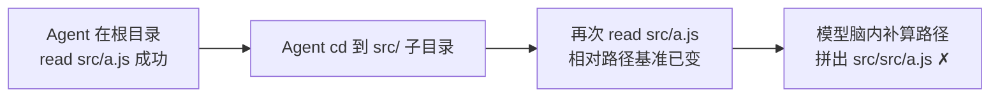

# Harness 案例分析：为什么"挽具"决定 Agent 成败

参考资料：

- [Anthropic《Building Effective Agents》附录2 "Prompt Engineering Your Tools"](https://www.anthropic.com/engineering/building-effective-agents)
- [《构建高效Agent》中文翻译（附录2 工具提示工程）](https://blog.csdn.net/weixin_43807749/article/details/152788870)
- [《Hello-Agents》第9章 上下文工程](https://github.com/datawhalechina/hello-agents/blob/main/docs/chapter9/%E7%AC%AC%E4%B9%9D%E7%AB%A0%20%E4%B8%8A%E4%B8%8B%E6%96%87%E5%B7%A5%E7%A8%8B.md)

***

## 0. 结论先行

**Harness（挽具）是包裹模型的那一层工程结构**：工具定义、参数格式、上下文装配、反馈解析、控制循环。模型是"大脑"，Harness 是"双手与感官"。

本篇两个案例的核心结论：

1. **同一个模型，换个工具格式，表现判若两模**——diff 补丁 vs 全文重写、JSON vs Markdown，在软件工程上是"无损转换的表象"，对 LLM 却是"会与不会"的鸿沟。
2. **把工具参数从相对路径改成绝对路径，SWE-bench 智能体从"频繁出错"变为"准确无误"**——Anthropic 团队自述在 SWE-bench 上"优化工具的时间超过优化提示词"。

推论：**模型能力 × Harness 质量 = Agent 实际能力**。Harness 差，再强的模型也在"漏水"；Harness 好，普通模型也能稳定交付。这正是 Anthropic 三原则中 "Carefully craft your agent-computer interface (ACI)" 的含义——**为模型设计工具接口，要像 UX 设计师为人类设计界面一样用心**。

***

## 1. 概念界定：Model + Harness = Agent

### 1.1 Harness 是"模型之外的一切"

```bash
┌─────────────────────────────────────────────┐
│                 Harness（挽具层）             │
│                                             │
│  工具定义（名称/参数schema/描述）               │
│  工具格式约定（diff？全文？JSON？Markdown？）    │
│  上下文装配（GSSC：汇集/筛选/结构化/压缩）        │
│  反馈解析（工具结果如何回喂模型）                │
│  控制循环（迭代、终止、防死循环）                │
│                                             │
│   ┌───────────┐          ┌───────────┐      │
│   │ LLM 大脑   │ ◄──────► │ 外部环境   │      │
│   └───────────┘          └───────────┘      │
└─────────────────────────────────────────────┘
```

**核心等式：Model + Harness = Agent**。模型是"大脑"，Harness 是"双手与感官"。"模型之外的一切"具体指七个模块：

| 模块         | 职责                                            | 本篇落点                |
| ---------- | --------------------------------------------- | ------------------- |
| Prompt 编排  | 系统提示与任务指令的拼装、分区、校准                            | 5.2 节               |
| 工具调用       | 工具定义（名称 / 参数 schema / 描述）与格式约定（diff？全文？JSON？） | 第 2 节案例一            |
| 上下文管理      | GSSC：汇集 / 筛选 / 结构化 / 压缩                       | 5.3 节               |
| 记忆系统       | 会话记忆 + 持久化笔记，跨上下文重置保持状态                       | 5.4 节分层记忆           |
| 子 Agent 协调 | 主代理规划、子代理深挖、凝练回传                              | 5.4 节三板斧            |
| 错误恢复       | 工具失败后的自愈：自描述错误信息、重试、回退                        | 3.2 节 Poka-yoke（防呆） |
| 用户交互       | 进度反馈、人工接管、中断恢复                                | ——（本篇不展开）           |

判断一个环节是否属于 Harness 的标准：**它是否在"模型不改变"的前提下影响模型行为**。工具格式、路径约定、返回值结构、上下文裁剪，全都是——这就是"Harness 是模型之外的一切"的可操作定义。

同一个模型在不同 Harness 下差异有多大？实测：**GPT-4 Turbo 仅换编辑格式，基准得分 20% → 61%（3 倍差距）；SWE-bench 智能体仅改路径约定，从"频繁出错"到"准确无误"**（详见第 2、3 节）。

### 1.2 Harness 核心挑战：四大战场

| 挑战         | 具体问题                                                                           | 本篇落点                  |
| ---------- | ------------------------------------------------------------------------------ | --------------------- |
| **长任务稳定性** | ① Context Rot：上下文越长回忆越差（见 5.1）；② 循环失控：迭代不收敛、死循环、终止条件失效；③ 工具失败：调用报错后不自愈，错误逐轮滚雪球 | 5.1 节；6 节清单第 3 条      |
| **效果评估**   | 格式选型没有先验最优解，只能实测错误率；Harness 改动的收益必须用基准度量（如 Aider 编辑格式基准）                       | 2.3 节、6 节清单第 1 条      |
| **成本控制**   | Token 成本（diff 省 token 但易错，全文重写稳但费）；注意力预算的分配与节流                                 | 2.2 节表格、6 节清单第 4 条    |
| **可观测性**   | Agent 的决策与推理过程必须透明可追溯——否则无法区分"模型不行"还是"挽具不行"，评估与调试都无从下手                         | Anthropic 三原则之"过程透明化" |

四大挑战的共同点：**没有一个靠"换更强的模型"根治，全部要靠 Harness 工程解决**。

***

## 2. 案例一：工具格式差异——同一模型，表现显著不同

### 2.1 素材（附录2）

Anthropic 在附录2开头给出两个典型选择困境（CSDN 译文）：

> "例如文件编辑操作，既可通过生成差异补丁来实现，也可采用全文件重写方式；对于结构化输出，可选择在 Markdown 中嵌入代码，或采用 JSON 格式封装。在软件工程层面，这些格式差异仅属表象，均可实现无损转换。但对大语言模型而言，不同格式的编写难度存在显著差异。"

### 2.2 我的分析：diff 为什么难

| 维度       | diff 补丁              | 全文重写            |
| -------- | -------------------- | --------------- |
| 模型要做的事   | 精确计算行号区间 + 逐字复现上下文行  | 直接写出完整新文件       |
| 认知负荷     | 高（计数任务 + 逐字记忆任务叠加）   | 低（生成任务）         |
| 出错模式     | 行号偏移、上下文行幻觉一个字符即补丁失效 | 可能漏掉无关代码，但通常能应用 |
| Token 成本 | 低                    | 高               |

关键洞察：**diff 把"编辑"变成了两个模型天生不擅长的子任务——精确计数与逐字复现**。LLM 是概率生成器，不是确定性的文本处理器：让它"复现第 42-45 行原文"，它在补全倾向下极易"顺手修正"某个空格或换行，导致补丁上下文不匹配而应用失败。

外部实测佐证（Aider 编辑格式基准）：

- **同一个 GPT-4 Turbo，仅把编辑格式从 search/replace 类 diff（Aider 的 "diff" 格式）切换为 unified diff，基准得分就从 20% 跳到 61%**——此前它在该格式下极"懒"，用 `...` 省略大段代码导致编辑大面积失败；
- Aider 甚至为 llama3-70b 单独统计"格式正确率"——写 unified diff 时只有 73.5% 能通过格式校验，格式错误直接吃掉能力分。

注意方向性：**"哪种格式更准"因模型而异**。GPT-4 Turbo 是"写全文重写/搜索替换时偷懒漏代码"的反例，unified diff 反而救了它；小模型（如 llama3-70b）则相反，写 unified diff 格式错误率很高，"笨但稳"的全文重写才是它的最优解。本节表格描述的是格式固有的认知负荷结构，实测胜负由"模型特性 × 格式 × 解析器容错"共同决定——这正是 2.3 节"决策依据应是实测错误率"的落点。

这说明格式不是"实现细节"，而是**能力漏斗**：严格格式下，模型的真实能力在"写对格式"这一关就被大量截留。

### 2.3 JSON vs Markdown 的同理

JSON 要求括号/引号/转义严格配对，长文本嵌入字符串时转义错误率陡增；Markdown 代码块对模型更"原生"（训练语料中大量存在），但机器解析弱。**没有绝对优劣，只有"模型写得稳不稳"与"下游解析成本"的权衡**——决策依据应是实测错误率，而非工程直觉。

***

## 3. 案例二：SWE-bench 相对路径 → 绝对路径

### 3.1 素材（附录2 原文）

> "Poka-yoke your tools. Change the arguments so that it is harder to make mistakes. While building our agent for SWE-bench, we actually spent more time optimizing our tools than the overall prompt. For example, we found that the model would make mistakes with tools using relative filepaths after the agent had moved out of the root directory. To fix this, we changed the tool to always require absolute filepaths—and we found that the model used this method flawlessly."
> （给你的工具做防呆设计……在 SWE-bench 上我们花在优化工具上的时间比优化提示词还多……改为强制绝对路径后，模型"准确无误"地使用了该方法。）

### 3.2 我的分析：错在"隐式状态"，不在模型

相对路径的陷阱机制：



1. **相对路径依赖隐式状态**——"当前工作目录"。这个状态随 Agent 执行 `cd` 等操作动态变化，但模型对"环境当前状态"的感知来自上下文推理，不是真实文件系统；
2. 每次传路径，模型都要**脑内拼接**"当前目录 + 相对路径"，这是一次额外的隐式推理，每多一次推理就多一分出错概率；
3. 改为绝对路径后，**状态基准被钉死在工具契约里**：无论执行到哪一步，`/workspace/...` 永远指向同一位置。出错环节从"模型的隐式推理"转移到"工具侧的确定性保证"。

这就是 **Poka-yoke（防呆）设计**：不指望使用者（模型）永远不犯错，而是让错误**无法发生或立即暴露**。人类工程学的例子是 USB-C 不分正反；Agent 工程的例子是绝对路径、枚举参数、工具内校验 + 自描述错误信息。

***

## 4. 两个案例的共同原理：Harness 价值三定律

| 原理                 | 案例                     | 一句话                             |
| ------------------ | ---------------------- | ------------------------------- |
| **1. 降低生成格式的认知负荷** | diff → 全文重写            | 让模型做它擅长的"生成"，别做它不擅长的"精确计数/逐字复现" |
| **2. 隐式状态显式化或消除**  | 相对路径 → 绝对路径            | 工具契约里不该有"取决于上一步"的隐含前提           |
| **3. 防呆优先于提示词**    | SWE-bench 工具优化 > 提示词优化 | 与其反复叮嘱模型"小心"，不如让错误在接口层面不可能发生    |

三定律的共同哲学：**把"对模型能力的期望"转化为"对接口设计的约束"**。提示词说"请仔细数好行号"是期望；工具只收全文重写是约束。约束永远比期望可靠。

***

## 5. 与上下文工程的会师：Harness 是上下文工程的执行层

《Hello-Agents》第9章从另一端抵达同一结论：它把视角从"出"（模型 → 工具）转到"进"（上下文 → 模型），给出了系统化方法论。本节先把第9章骨架讲透，再与 Harness 视角合流。

### 5.1 从提示工程到上下文工程：管理"注意力预算"

一句话定义：**上下文工程关注"在每一次模型调用前，如何以可复用、可度量、可演进的方式，拼装并优化输入上下文"**。核心问题从提示工程的"提示词怎么写"升级为——**"什么样的上下文配置，最有可能让模型产出我们期望的行为？"**

"上下文"的范围也随之扩大：不只是系统提示，而是**采样时模型可见的全部 tokens**——系统指令、工具定义、MCP 数据、外部文档、消息历史。一个循环运行的 Agent 会不断产生下一轮可能相关的新数据，所以上下文工程的"艺与术"，在于**从持续扩张的候选信息宇宙中，甄别哪些内容该进入有限的上下文窗口**。

为什么必须甄别？第9章给出三层依据：

1. **上下文腐蚀（context rot）**：needle-in-a-haystack 基准显示，窗口内 tokens 越多，模型准确回忆信息的能力反而越差；
2. **架构根源**：Transformer 中每个 token 与所有 token 建立 n² 级两两注意力关系，长度增长后建模能力被"拉薄"；且训练语料中短序列远多于长序列，模型对"全上下文依赖"的经验与专门参数天然不足；
3. **性能梯度而非悬崖**：位置编码插值等技术可外推长度，但牺牲部分位置精确理解——长上下文下模型依旧强大，只是检索与长程推理精度下降。

由此得出资源观结论：**上下文是有限资源，且边际收益递减**——每新增一个 token 都在消耗模型的"注意力预算"。这与 Harness 三定律是同一种工程世界观：**与其指望窗口无限大，不如把预算花在刀刃上**。

### 5.2 有效上下文的"解剖学"：三个组件 + 一种检索范式

目标：**用尽可能少、但高信号密度的 tokens，最大化获得期望结果的概率**。

三个静态组件：

| 组件          | 要点                                                   | 常见误区                                   |
| ----------- | ---------------------------------------------------- | -------------------------------------- |
| 系统提示        | 分区组织（背景 / 指令 / 工具指引 / 输出描述），追求"最小必要信息集"——**最小 ≠ 最短** | 两极化：过度硬编码（脆弱的 if-else 堆栈）或过于空泛（缺少具体信号） |
| 工具          | 职责单一、低重叠、错误鲁棒、入参无歧义；甄别"最小可行工具集（MVTS）"                | 臃肿工具集——"选哪个工具"本身就成为含混决策                |
| Few-shot 示例 | 精选**多样且典型**的示例直接画像期望行为                               | 把所有边界条件一股脑塞进提示                         |

校准方法：先用最强模型在最小提示上试跑，再依据失败模式增补指令与示例——先建立基线，再做增量。

第9章这里有一句可直接刻在 ACI 清单旁的话：**"如果人类工程师都说不准用哪个工具，别指望智能体做得更好。"**——与 Anthropic "像 UX 设计师一样打磨工具"完全同频。

一种动态检索范式（9.2.2）：从"推理前一次性检索"转向 **JIT（Just-in-time）上下文**——

- 不预载全量数据，只维护**轻量引用**（文件路径、存储查询、URL），运行时用工具按需加载，配合 `head` / `tail` / `grep` 分析大体量数据；
- **引用的元数据本身在传达语义**：`tests/test_utils.py` 与 `src/core/test_utils.py` 的路径暗示不同；目录层级、命名约定、时间戳都在隐含传递"目的与时效"；
- **渐进式披露（progressive disclosure）**：每步交互产生新上下文，反过来指导下一步决策——按层构建理解，工作记忆只保留"当前必要子集"；
- 代价与折中：运行时探索比预计算慢，且缺少引导会误用工具、追逐死胡同；工程上用**混合策略**——前置加载少量高价值上下文（README / 项目约定）保证速度，同时提供 `glob` / `grep` 原语支持即时探索。

### 5.3 GSSC 流水线：上下文构建的工程化落地

第9章用 ContextBuilder 把"拼装上下文"抽象为四阶段流水线，对应定义中的"可复用、可度量、可演进"：


| 阶段        | 核心机制                                                                          | 关键工程细节                                              |
| --------- | ----------------------------------------------------------------------------- | --------------------------------------------------- |
| Gather    | 多源汇集：系统指令 + 记忆检索 + RAG 检索 + 最近 5 条历史 + 自定义信息包                                 | 每个数据源 try-except 容错，单源失败不影响整体；系统指令标记最高优先级、不参与评分     |
| Select    | 综合分 = 0.7 × 相关性 + 0.3 × 新近性；相关性用 Jaccard 关键词重叠（生产环境换向量相似度），新近性用指数衰减（24 小时内高分） | `min_relevance` 阈值过滤低质信息；按分数降序**贪心填充**，token 预算用尽即停 |
| Structure | 输出固定骨架：`[Role & Policies] [Task] [Evidence] [Context] [Output]`               | 固定分区带来可读性、可调试性（问题可定位到区）、可扩展性（新信息源 = 新分区）            |
| Compress  | 超限时做**分区级**兜底压缩：预算内完整保留，末尾放不下的分区截断并标注                                         | 即使压缩也保持结构完整性                                        |

两个值得直接抄走的配置思想：

- **预算守护**：`reserve_ratio`（默认 0.2）为系统指令预留空间，保证关键信息不会被候选信息挤占；
- **先召回后精确**：压缩调参先保证"不漏关键信息"，再优化"剔除冗余"。

### 5.4 长时程三板斧与分层记忆

窗口不可能无限扩，长时程任务（大型代码库迁移、跨天研究）必须直面上下文污染。第9章三板斧及取舍法则：

| 手段                             | 一句话                                                   | 适用场景               |
| ------------------------------ | ----------------------------------------------------- | ------------------ |
| 压缩整合（Compaction）               | 接近上限时高保真总结，带摘要重启新窗口；安全的"轻触式"第一刀是清理**深历史中的工具调用与结果**    | 长对话连续性，强调"接力"      |
| 结构化笔记（Structured note-taking）  | 以固定频率把关键信息写入上下文外的持久化存储（TODO / NOTES.md / 结论索引），后续按需拉回 | 有里程碑 / 阶段性成果的迭代式任务 |
| 子代理架构（Sub-agent architectures） | 主代理负责规划与综合，专长子代理在干净窗口里深挖，只回传 1,000–2,000 tokens 凝练摘要  | 复杂研究与分析，可并行探索      |

配套实现是一套**分层记忆**（9.6 长程代码库维护助手案例）：

- **即时访问层（TerminalTool）**：只读命令白名单（`ls` / `grep` / `head` / `awk` 等）+ 路径验证，实现 JIT 文件系统探索，免预索引、免沉没成本；
- **会话记忆层（MemoryTool）**：短期工作记忆、情景记忆、语义记忆；
- **持久笔记层（NoteTool）**：Markdown + YAML 前置元数据，按 `task_state` / `conclusion` / `blocker` / `action` 分类，跨会话、跨上下文重置保持进度一致；每轮构建上下文前检索相关笔记，以较高相关性分数注入 ContextPacket。

分层原则：**信息按"时效 + 用途"决定放哪一层**——即时探索的不入库，阶段性结论才落盘，避免三层之间冗余与不一致。

### 5.5 合流：进 / 出双向框架（本篇核心整合）

两个视角拼起来正好完整：

| 方向          | 问题                | 对应机制                                     |
| ----------- | ----------------- | ---------------------------------------- |
| 进（上下文 → 模型） | 上下文腐蚀、注意力预算、相关性退化 | GSSC 流水线、JIT 检索 + 渐进式披露、压缩整合、结构化笔记、子代理架构 |
| 出（模型 → 工具）  | 格式写错、参数拼错、隐式状态踩坑  | 工具格式选择、Poka-yoke 参数设计、ACI 接口打磨           |

特别值得注意的交叉点：**工具输出是上下文污染的最大来源**。第9章"轻触式压缩"的第一刀就是清理"深历史中的工具调用与结果"（见 5.4）。所以 Harness 的"出"侧设计（工具返回什么、返回多大、错误信息是否自描述可恢复）直接决定"进"侧的压缩压力——**返回值设计得好，压缩就少做一半**。

这也是本篇把 Anthropic 两案例与第9章放进同一框架的原因：**上下文工程定义了"进"侧的科学，Harness 工程负责"出"侧的工艺，而工具的输入/输出恰好是两者的接口**。

***

## 6. ACI 设计清单（可落地）

给模型设计工具接口时逐条自检：

1. **格式选型看实测**：同一功能先用最简格式（全文重写/Markdown）跑通，确有成本压力再换紧凑格式（diff/JSON），并以错误率为准绳；
2. **参数防呆**：强制绝对路径/完整 ID；枚举值代替自由字符串；数量、格式类参数在工具内校验；
3. **错误自描述**：失败返回"哪里错 + 怎么改"（如 `old_str 出现了 3 次，请扩大上下文使其唯一`），让模型能自愈，而不是返回裸异常；
4. **返回值节流**：截断超长输出、结构化关键字段，别让一次 `ls` 的 5000 行结果灌爆上下文；
5. **消除隐式依赖**：工具行为不依赖"上次调用留下的环境状态"；确有状态就显式参数化；
6. **先磨工具再磨提示词**：SWE-bench 的经验——工具优化投入产出比高于提示词优化。

***

## 7. 一句话收束

> 提示词工程决定模型"想什么"，Harness 工程决定模型"能不能做到"。案例证明：**换对工具格式与参数契约，同一模型的表现可以从频繁出错跃迁到准确无误**——在抱怨模型能力之前，先检查你给它套的挽具。

Anthropic 把它列为三原则之一（ACI），《Hello-Agents》用整章上下文工程呼应它，Aider 用 20% → 61% 的数据丈量它。结论一致：**Agent 系统的上限由模型决定，下限由 Harness 决定；生产环境的稳定性，通常卡在 Harness 上。**
