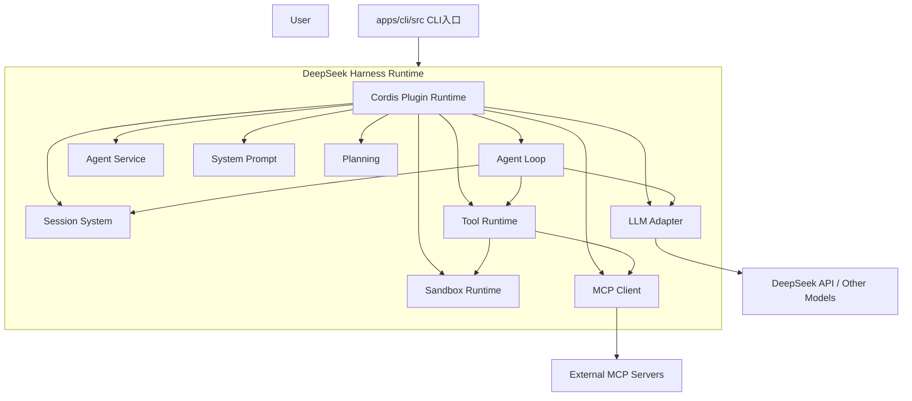

# DeepSeek Harness Architecture

## 1. 总体架构



## 2. 核心执行流程

```
User Task
    |
CLI Entry
    |
Create Agent Session
    |
Build Context + Prompt
    |
Agent Loop
    |
LLM Reasoning
    |
Tool Call
    |
Sandbox / MCP Execution
    |
Observation
    |
Continue Loop
    |
Final Response
```

## 3. Plugin Architecture

DeepSeek Harness 的核心设计理念：

> Everything is a Plugin

包括：

- Agent
- LLM
- Tool
- Session
- Sandbox
- MCP

插件通过 Runtime 注册，并通过 Context API 相互访问。

结构：

```
              Cordis Runtime

                    |
 ----------------------------------------
 |          |          |          |      |
Agent      LLM       Tool     Session  Sandbox/MCP
Plugin   Plugin    Plugin    Plugin    Plugin
```

## 4. Monorepo结构

```
deepseek-harness

├── apps
│   └── cli
│       └── src

├── packages
│   ├── core
│       ├── agent
│       ├── agent-loop
│       ├── tools
│       ├── session
│       └── system-prompt
│   ├── llm
│   ├── mcp
│   ├── sandbox
│   ├── plan
│   └── bundle
```

## 5. 分层理解

### 入口层

apps/cli

负责：

- CLI参数解析
- Runtime启动
- 加载配置

### Runtime层

负责：

- 插件生命周期
- 服务注册
- Event Bus

### Agent层

packages/core

负责：

- Agent循环
- Session管理
- Tool调度

### 能力层

包括：

- LLM调用
- MCP工具
- Sandbox执行
- Planning

## 6. Agent Loop 执行流程

```
User Task
    |
Agent Loop
    |
LLM Reasoning
    |
Tool Call
    |
Sandbox / MCP Execution
    |
Observation
    |
Continue Loop
    |
Final Response
```

------------------------------------------------------------------------

## 7. Agent Loop 可替换机制

DeepSeek Harness 中，Agent Loop 不是固定写在 Runtime 内部，而是作为
Plugin 注册。

默认：

    Runtime
       |
    Default Agent Loop Plugin
       |
    LLM + Tools

如果需要改变 Agent 行为，可以新增自定义 Loop Plugin：

    Runtime
       |
    Custom Agent Loop Plugin
       |
    Planner / Reflection / Multi-Agent Workflow

例如：

-   ReAct Loop
-   Plan-Execute Loop
-   Reflection Loop

只需实现新的 Agent Loop，并在启动配置中替换插件，无需修改 Runtime
核心代码。

------------------------------------------------------------------------

## 8. 总体理解

DeepSeek Harness 可以理解为：

    Agent Runtime
    +
    Plugin System
    +
    LLM Layer
    +
    Tool Ecosystem
    +
    Sandbox
    +
    MCP

它提供的是一个可持续扩展的 Agent 运行平台，而不仅是简单的 Agent API。
